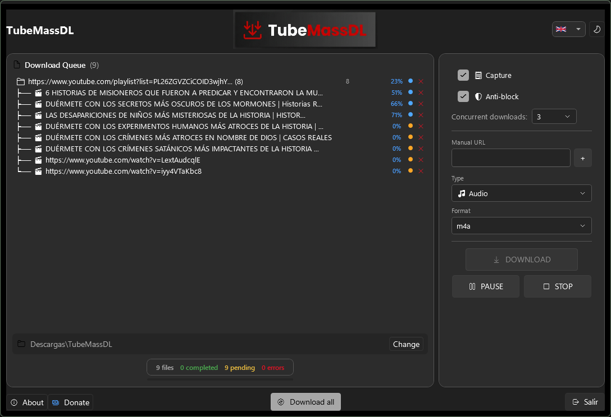
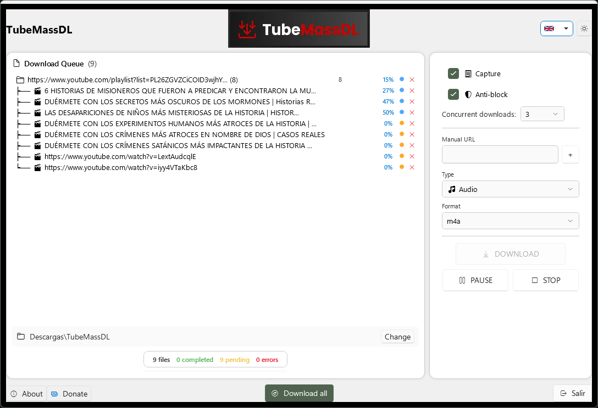
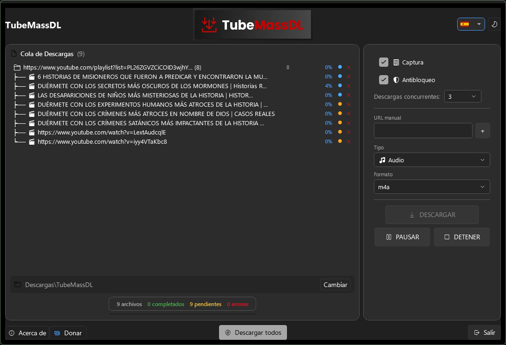
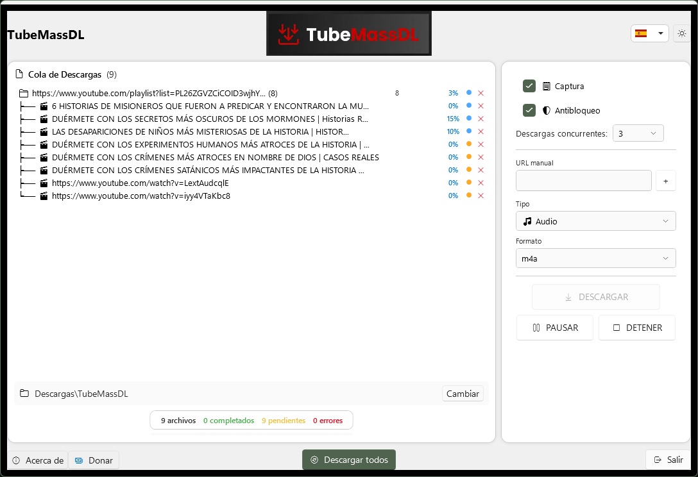

# TubeMassDL — Cazador de Enlaces y Descargador Masivo

TubeMassDL is a modern Windows desktop application (.NET 8 WPF) for automatically capturing, queuing, and mass-downloading videos and audio from YouTube and 1800+ supported sites via `yt-dlp`.

## Screenshots

| English Dark | English Light |
|:---:|:---:|
|  |  |
| **Spanish Dark** | **Spanish Light** |
|  |  |

## Features

### Clipboard Auto-Capture
Links are captured automatically from the clipboard as you browse. Just copy a URL (Ctrl+C) and it appears in the download queue — no manual input required.
- Supports YouTube, Vimeo, TikTok, Instagram, Facebook, X/Twitter, Twitch, Dailymotion, and direct file URLs (mp4, avi, mkv, zip, pdf, etc.)
- Filters out unsupported URLs automatically
- Duplicate detection with manual URL input fallback

### Playlist Expansion
- Copy a YouTube playlist URL → automatically fetches all video entries via `yt-dlp --flat-playlist`
- Hierarchical tree display with `├──` / `└──` characters
- Double-click to expand/collapse playlists
- Item count shown in the queue
- **Parent playlist progress** calculated as the average of all child items

### Download Types
| Type | Quality Options | Format Options |
|------|----------------|----------------|
| Video | 4K, 1080p, 720p, 480p, 360p | MP4, AVI, WebM, MKV |
| Audio | Best available | MP3, M4A, Opus, WAV |

### Anti-Blocking Engine
When enabled:
- Random sleep intervals (5–30s)
- Rate limiting (5 MB/s)
- Retries (3 per video)
- Fragment retries (3 attempts)
- No modification timestamps
- `--wait-for-video 5`
- Randomised delays per download (5–15s initial, 15–30s max)

### Concurrent Downloads
- Selectable concurrency: **1, 3, 5, or 10** simultaneous downloads
- Auto-priority queue with intelligent scheduling

### Browser Cookie Detection
Automatic detection and use of cookies from installed browsers for authenticated content:
- **Chrome** — `Google\Chrome\User Data\Default\Cookies`
- **Edge** — `Microsoft\Edge\User Data\Default\Cookies`
- **Firefox** — `Mozilla\Firefox\Profiles\*.default(-release)\cookies.sqlite`
- **Brave** — `BraveSoftware\Brave-Browser\User Data\Default\Cookies`
- **Opera** — `Opera Software\Opera Stable\Cookies`

When a login-required error is detected, the app shows a clear translated message and cookie status.

### Multi-Language Support
| Language | Locale |
|----------|--------|
| English | en |
| Español | es |
| Français | fr |
| Deutsch | de |
| Português | pt |
| Italiano | it |
| 中文 | zh |
| 日本語 | ja |

Language is auto-detected from the OS on first run, and can be changed at any time from the header selector. Every UI element — including the options panel, context menus, and the About dialog — updates immediately on switch.

### Dark / Light Theme
Full application theme support via WPF-UI and custom Aether theme dictionaries. Toggle with one click in the header.

### Select & Batch Operations
- **Checkbox selection** per item (multi-select)
- **Download** applies to all checked items
- **Download All** (header button) queues every pending/errored item
- **Pause/Resume** controls selected active downloads, or pauses the whole engine
- **Stop** cancels selected active/queued items and cleans up `.part` files
- **Delete** key removes selected items from the queue
- **Clear All** removes all processed/errored items

### Keyboard & Mouse
- `Delete` — Remove selected items from queue
- **Double-click Playlist** — Expand / collapse
- **Double-click Queued / Error item** — Start download immediately
- **Double-click Downloading item** — Pause and requeue at the end

### App Update Checker
- Checks the **TubeMassDL** GitHub releases page for new app versions (not yt-dlp)
- Shows "Update available" with version number and download prompt
- Falls back gracefully on network errors
- Built into the About dialog

### yt-dlp Auto-Update
On startup, the app checks GitHub for the latest `yt-dlp.exe` release and auto-downloads it.

### Output Path
Default download folder: `%USERPROFILE%\Downloads\TubeMassDL` (changeable via folder picker or manual edit). Persisted across sessions.

### Part-File Cleanup
`.part` and `.ytdl` temporary files are automatically cleaned up on permanent failure or explicit stop, but preserved on cancel/resume to allow yt-dlp resumption.

## Screenshots

| English Dark | English Light |
|:---:|:---:|
|  |  |
| **Spanish Dark** | **Spanish Light** |
|  |  |

## Architecture

```
TubeMassDL/
├── TubeMassDL.sln
├── TubeMassDL/                          # Main WPF application
│   ├── App.xaml.cs                      # App startup, services wiring, preferences
│   ├── Models/
│   │   ├── CapturedLink.cs              # Clipboard link model
│   │   ├── Enums.cs                     # LinkType enum (VideoLink / Playlist / Channel)
│   │   └── SiteInfo.cs                  # Site detection result
│   ├── Services/
│   │   ├── ClipboardMonitor.cs          # 500ms clipboard polling
│   │   ├── LinkCollector.cs             # Queue management + playlist tree + progress
│   │   ├── DownloadManager.cs           # Concurrent download orchestrator
│   │   ├── YtDlpDownloader.cs           # yt-dlp process wrapper with retry + cookie
│   │   ├── YtdlpUpdater.cs              # Auto-update yt-dlp from GitHub
│   │   ├── HttpDownloader.cs            # Direct file download via HttpClient
│   │   ├── SiteDetector.cs              # URL → site name mapping
│   │   ├── TaskbarFlashService.cs       # Win32 FlashWindowEx API
│   │   ├── AppUpdateService.cs          # Check TubeMassDL app version on GitHub
│   │   ├── BrowserCookieService.cs      # Detect Chrome/Edge/Firefox/Brave/Opera cookies
│   │   └── Translations.cs              # 8-language translation dictionary
│   ├── Converters/
│   │   ├── FileListConverters.cs        # Icon, extension, size, status dot converters
│   │   ├── TreeItemConverters.cs        # Playlist expand/collapse visibility
│   │   ├── StatusToColorConverter.cs    # Status → brush color
│   │   └── ProgressVisibilityConverter.cs
│   ├── Panels/
│   │   └── OptionsPanel.xaml            # Right sidebar: download/pause/stop/options
│   └── Resources/
│       ├── QueueItemTemplate.xaml       # List item DataTemplate with progress bar
│       ├── app.ico
│       ├── tubemassdl-banner.png
│       └── tubemassdl-logo.png
└── NoCloudware.UI.Core/                 # Shared UI library (Aether theme)
    ├── Controls/
    │   ├── ShellWindow.xaml             # Main window shell (header + footer bars)
    │   ├── BaseMainControl.xaml         # Two-panel layout (file list + options)
    │   ├── FileListBox.xaml             # File list with columns + double-click
    │   ├── LanguageSelector.xaml        # Flag dropdown menu
    │   ├── ThemeToggle.xaml             # Dark/light toggle button
    │   ├── AboutDialog.xaml             # About dialog with update checker
    │   ├── StatusBar.xaml               # Counter bar (total / completed / pending / errors)
    │   ├── DropZone.xaml                # Drag-and-drop file zone
    │   └── ThreeStateToggle.xaml        # Three-way toggle control
    ├── Themes/Aether/                   # Complete Aether theme system
    │   ├── AetherTheme.xaml
    │   ├── AetherColors.xaml
    │   ├── AetherColors.Dark.xaml
    │   ├── AetherColors.Light.xaml
    │   ├── AetherButtons.xaml
    │   ├── AetherTypography.xaml
    │   ├── AetherWindow.xaml
    │   ├── AetherDropZone.xaml
    │   ├── AetherFileList.xaml
    │   ├── AetherStatusBar.xaml
    │   └── AetherAnimations.xaml
    ├── Services/
    │   ├── ThemeService.cs              # ApplicationThemeManager + Aether swap
    │   ├── LanguageService.cs           # Culture detection + switching
    │   └── DonationService.cs           # Opens donation URL in browser
    └── ViewModels/
        ├── BaseFileItem.cs              # Observable item model (CommunityToolkit.Mvvm)
        └── BaseFileItem.Commands.cs     # Delete + toggle playlist commands
```

## Quick Start

### Prerequisites
- .NET 8.0 SDK (Windows)
- `yt-dlp.exe` — auto-downloaded on first run (or place manually in the output directory)
- A browser with session cookies (Chrome, Edge, or Firefox) for authenticated content

### Build & Run
```bash
git clone https://github.com/nocloudware/TubeMassDL.git
cd TubeMassDL
dotnet build
dotnet run --project TubeMassDL
```

Or open `TubeMassDL.sln` in Visual Studio and press F5.

### Usage
1. Launch the app
2. Copy any video/playlist URL → it appears in the queue automatically
3. Configure type (video/audio), quality, format, and anti-block in the right panel
4. Click **DESCARGAR** for selected items, or **Descargar todos** (header) for all
5. Monitor real-time progress bars and the status bar (total / completed / pending / errors)
6. Use **PAUSAR** / **DETENER** to control active downloads
7. Double-click any item for quick actions

## Configuration
Settings are persisted in `appsettings.json` in the app directory and restored on startup:
```json
{
  "Settings": {
    "DarkTheme": true,
    "Language": "auto",
    "MaxConcurrentDownloads": 3,
    "DefaultOutputPath": "C:\\Users\\<you>\\Downloads\\TubeMassDL",
    "AntiBlockMode": true
  }
}
```

## Tech Stack
| Component | Technology |
|-----------|------------|
| Framework | .NET 8.0 |
| UI | WPF + WPF-UI 4.3.0 |
| Language | C# 12.0 |
| MVVM | CommunityToolkit.Mvvm 8.4.0 |
| Download Engine | yt-dlp |
| UI Library | NoCloudware.UI.Core (Aether theme) |

## License
MIT License

## Links
- [Report Issues](https://github.com/nocloudware/TubeMassDL/issues)
- [yt-dlp Documentation](https://github.com/yt-dlp/yt-dlp)
